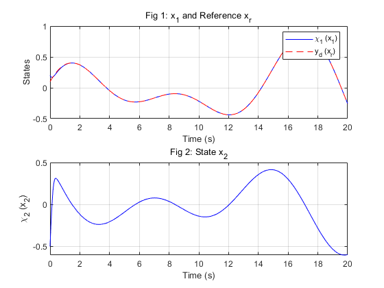

# Reinforcement Learning-Based Adaptive Finite-Time Performance Constraint Control Simulation

## Overview

This project aims to reproduce and simulate a Reinforcement Learning-based Adaptive Finite-Time Performance Constraint Control method for a second-order nonlinear system using MATLAB. The control strategy combines techniques from Reinforcement Learning (RL), adaptive control, finite-time control theory, and Prescribed Performance Control (PPC). This ensures that the system state errors converge to a predefined, time-varying boundary within a finite time while optimizing a certain performance index.

## System Model

The second-order nonlinear system simulated in this project is described as:

*   **State Equations**:
    ```
    dx1(t)/dt = x2
    dx2(t)/dt = -4.9 * sin(x1) - x2 + u
    y(t) = x1
    ```
*   **Initial States**:
    ```
    x1(0) = 0.2
    x2(0) = -0.5
    ```
*   **Reference Trajectory (Desired Output `y_d`, denoted as `x_r`)**:
    ```
    x_r(t) = -0.4 * exp(-0.3*t) + 0.6 * sin(0.5*t) + 0.5 * cos(0.7*t)
    ```

## Controller Characteristics

*   **Adaptive Laws**: Used to estimate unknown system dynamics (or their bounds).
*   **Actor-Critic Neural Networks**: Employed to approximate the optimal control policy and the value function. Radial Basis Function (RBF) neural networks are used in this implementation.
*   **Finite-Time Convergence**: Ensures error convergence in finite time through specific controller design and Lyapunov stability analysis.
*   **Prescribed Performance Control (PPC)**: Guarantees that the tracking error evolves within predefined, time-varying bounds `|e(t)| < kappa(t)` using error transformation and a performance function `kappa(t)`.

## File Structure

*   `main_simulation.m` (or your chosen main script name): Main simulation program.
*   (If `system_dynamics`, `rbf_eval`, `signed_power` are in separate files, list them here. The current code embeds these within the main script.)

## How to Run

1.  Ensure you have MATLAB installed (no special toolboxes are typically required beyond the standard ODE solvers).
2.  Open the main script file (e.g., `main_simulation.m`) in the MATLAB editor.
3.  Click the "Run" button in the MATLAB editor or type the script name in the MATLAB command window and press Enter.
4.  After the simulation completes, several figures will be displayed, showing time histories of system states, tracking errors, control input, neural network weights, etc.

## Simulation Results

This section presents the key simulation results, demonstrating the controller's effectiveness in tracking the reference trajectory, ensuring error convergence within prescribed bounds, and the adaptation of the neural network weights.

*(Please replace the following image paths with the actual paths to your uploaded images in the `images` folder or your chosen folder.)*

**1. State Tracking Response (x₁ and x₂):**
This figure displays the time evolution of the system states `x₁` and `x₂`. It shows how `x₁` (the system output) tracks the desired reference trajectory `xᵣ`, and the behavior of the second state `x₂`.



**2. Error Convergence Curves (z₁ and z₂):**
These plots illustrate the tracking errors `z₁ = x₁ - xᵣ` and `z₂` (the error in the second step of the backstepping design). Crucially, they demonstrate that the errors remain within their respective prescribed performance bounds (`±κ₁(t)` and `±κ₂(t)`), showcasing the effectiveness of the Prescribed Performance Control.


**3. Neural Network Weights Convergence:**
This figure shows the convergence behavior of the neural network weights over time. Stable and convergent weights indicate that the adaptive learning mechanism is functioning correctly to approximate the unknown system dynamics or optimal control components. (You might want to specify which weights are shown, e.g., Actor weights `Wa1` or a selection of them).


